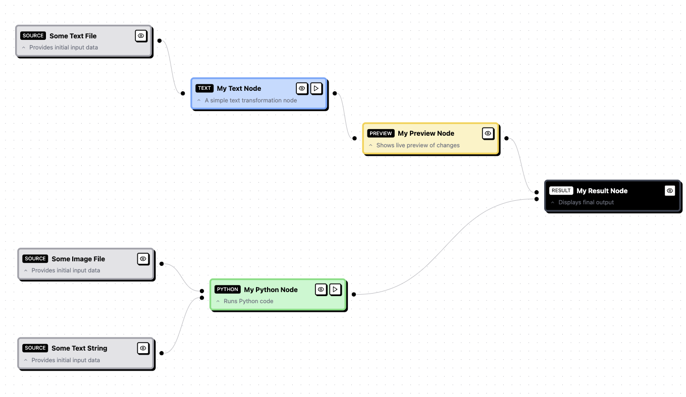

# Kiddie Flow (PoC)
Simple workflow tool with neobrutalist inspired design using Reactflow.

[Demo here](https://benevolent-biscotti-ec1fce.netlify.app).


## Install
Run with `docker`:
```
docker build -t kiddie-flow .
docker run -p 5173:5173 kiddie-flow
```

## Screenshots
Use a variety of nodes to accomplish a task:




Simple yet powerful configuration:

